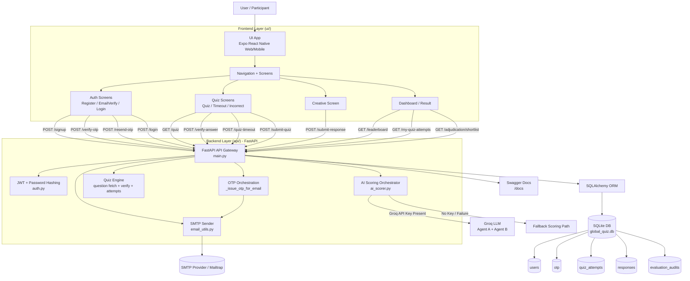

# Global AI Skill Challenge - Architecture Workflow Diagram

## Flow Summary

1. User interacts with Expo UI screens.
2. UI calls FastAPI endpoints for auth, quiz, submission, and leaderboard.
3. Backend validates user/session and executes business rules.
4. OTP path uses SMTP integration for verification emails.
5. Quiz path enforces attempts, scoring, and pass criteria.
6. Creative path enforces 25-word rule and runs AI scoring (Groq or fallback).
7. Results and audit events are persisted in SQLite tables.
8. Leaderboard and attempts endpoints read persisted data for UI display.

